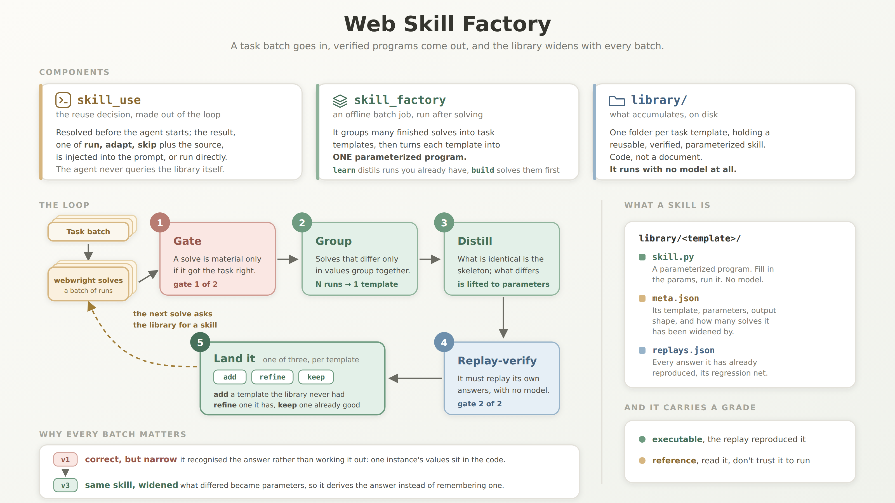

# Web Skill Factory: Evolving Reusable, Verified, Code-Native Skills for Web Agents

**Most agent skills are context the model refers to. Ours are programs.**
 
Every task Webwright solves leaves a working script behind. The Skill Factory turns those
scripts into a growing library of **reusable, verified, parameterized skills**: code you can
run without a model and compose into the next task instead of re-exploring the site.

## 🎥 Demo


https://github.com/user-attachments/assets/a6cb7d8e-2411-4d14-b85e-4255ccb1ae81


## ✨ Highlights
 
- 🏃 **Runs standalone, no model.** A learned skill is just code. It re-executes in ~40 s with zero tokens, so you can schedule it to run every day, instead of having a model re-read a note and redo the work every time.
- 🛠️ **Has a real software-engineering surface.** Because skills are code, they inherit code's tools and properties for free: inheritance, polymorphism, encapsulation, tests, versioning, and history. A skill is executable and verifiable, not prose the model has to interpret.
- ✅ **Verified twice before it lands.** First an input gate: a solve only becomes material if it got the task right, so a wrong answer never feeds a skill. Then the distilled skill must replay its own answers standalone, with no model, so a broken skill can't slip in and poison the library.
- 🌱 **Gets stronger the more you use it.** New solves widen a skill in place, self-evolving as you go. Regression-replay keeps old coverage from breaking, so a skill that's already been verified is never damaged by a later change.


## 🗺️ How it works



The system adds two integration points to WebWright without changing the agent loop:

* **Reuse, resolved out of the agent loop:** before the agent starts, the library is checked for a skill that fits the task, and only the *result* is used — injected into the agent's prompt as a hint, or (via `route`) run directly with no agent at all. The agent never spends its own steps querying the library.
* **Library growth after solving:** the `skill_factory` CLI, through `init`, `build`, `learn`, and `update`.

`route` is the entry point for skill reuse. Internally, it calls `recommend` to retrieve candidate skills, evaluate their fit, and return a `run`, `adapt`, or `skip` decision along with the selected skill, reuse instructions, and filled parameters. It then acts on that decision by either executing the skill directly, passing it to the agent as a prior, or starting the agent from scratch.

After solving, the library grows from the runs you already have. Solves of the same task template are aligned: what is identical becomes the skeleton, and what differs is lifted into parameters, giving one parameterized program per template. The expensive part, driving the site itself, is factored into named primitives (log in, run a search, read the results table), so a later task on the same site can call them even when its final step differs.

Two gates decide what lands: before distillation, only correct solves become material; after it, the candidate must replay its own answers standalone, with no model. When a template already exists, its skill is widened in place, and every answer it previously reproduced is replayed alongside, so a later batch can't break what already worked.

<details>
<summary><b>How it compares to related work</b></summary>
<br>

|  | published `SKILL.md` | [SkillOpt](https://github.com/microsoft/SkillOpt) | [OpenClaw Skills](https://docs.openclaw.ai/tools/skills) | [Hermes Agent-Skills](https://hermes-agent.nousresearch.com/docs/user-guide/features/skills) | **Web Skill Factory (Ours)** |
|---|---|---|---|---|---|
| **what a skill is** | a document the model reads | a document the model reads | a document (with optional helper files) the model reads and follows | a document (a Markdown `SKILL.md`, optional files) the agent loads on demand and follows | **an executable program — no model to run it (the agent can still use it)** |
| **how one skill covers different inputs** | the model interprets the author's written guidance for each input | the model adapts the optimized document to each input | the model interprets the document for each input, handling variation implicitly rather than through explicit parameters | the model interprets the document for each request, handling variation implicitly rather than through explicit parameters | **verified runs of the same task template are aligned; their observed differences may become explicit parameters in one executable skill** |
| **how it's verified** | no built-in verification requirement | a candidate replaces the current document only if it scores higher on a validation split | provenance and security are checked before a skill is installed or applied, and a self-learned change stays pending until a human applies it — but the skill is not replayed to verify its outputs against recorded answers | provenance and security are checked before a skill is installed or written, and agent writes can optionally be staged for human approval — but the skill is not replayed to verify its outputs against recorded answers | **the program must reproduce its recorded answers exactly to check consistency; supplying known answers additionally checks correctness** |
| **how the library evolves from runs** | it does not evolve automatically | scored runs are used to update a skill document — edits kept only when they raise the validation score | with self-learning enabled, user corrections or a review of a successful run may create or update a pending skill proposal; applying it adds or updates a live `SKILL.md`, while unused Workshop-created skills may later become stale or archived | after a run, a reflection can edit the skill document — create, rewrite, or delete it — but the change is model-authored prose from that one reflection, not grounded in aligning multiple verified runs, explicit parameters, or replaying the resulting skill | **evolution is grounded in verified runs: a new template adds an executable skill; an adapted run is refined back in — aligned against the other solves, its differences lifted into explicit parameters — and regression-replay re-checks every answer the skill already reproduced, so an update can't break what already worked** |

_Compared as of 2026-08-03, against SkillOpt @ 61735e3, OpenClaw v2026.7.1, and Hermes Agent v0.20.0. These projects move quickly and this table may fall behind. If we've mischaracterized your project, please open an issue or PR, we'll fix it._

</details>

The Quick Start below demonstrates the complete workflow.

## 🚀 Quick Start

Set it up once. The module ships with Webwright, so clone the repository and install it locally:

```bash
git clone https://github.com/microsoft/Webwright.git
cd Webwright
python3 -m venv .venv
source .venv/bin/activate
pip install -e .
playwright install chromium
```

Then configure a model. Step 1 does not require one, but every subsequent step does:

```bash
export OPENAI_API_KEY=...
```

<details>
<summary><b>Using a custom OpenAI-compatible gateway</b></summary>
<br>

Export two environment variables. That is the entire setup:

```bash
export OPENAI_ENDPOINT=https://your-gateway/api/responses   # Full request URL, not a base URL
export OPENAI_MODEL=your-model
```

`init`, `learn`, `build`, and `route` all respect these variables.

This also applies to the browser agent, even though its model configuration comes from YAML and cannot read environment variables directly. `build` and `route` translate the environment variables into the appropriate agent configuration, and `build` prints the final configuration it used.

You only need a custom YAML file when you want the browser agent to use a different model from the one used for skill distillation. Copy [`examples/model_gateway.example.yaml`](examples/model_gateway.example.yaml), set `model_name` and `openai_endpoint`, and pass it with `-c base.yaml -c $HOME/my_gateway.yaml` to `build` or `route`. Because `-c` replaces the default configuration files, make sure to include `base.yaml`.

</details>

### 1. Run a learned skill

Task: *what is the earliest nonstop flight from A to B on this date?*, on the
live Google Flights.

A learned skill is a plain CLI. Run it directly — no model, no API key, about 40 seconds:

```bash
python src/webwright/skill_factory/examples/learned_library/what_is_the_earliest_nonstop_flight_from_2c8dab1/skill.py \
    --origin-city Seattle --origin-code SEA --destination-city Denver --destination-code DEN --date 2026-08-26
```

The skill takes its five parameters as `--flags` — a city name and its airport code for each endpoint (`--origin-city Seattle --origin-code SEA`), plus `--date`; it also accepts a positional `taskspec.json`, which is what replay and programmatic callers use. Change the cities, codes, and date for your own route.

It prints the ten fixed steps it executed and the location of the saved screenshots. The steps are encoded in the skill, not chosen by a model. The run directory (under `$WORKSPACE_DIR`) contains the full trajectory.

> **`strict` replay proves only that the skill reproduced its training run in the original environment.** Because it uses Playwright against a live site, OS differences or site changes can still break it. For example, a skill learned on Linux may fail on macOS if it relies on `Control+A` to clear a field. Replay verification is not the same as generalization across platforms.
>
> When standalone execution fails, `route` can still pass the skill to the agent in `adapt` mode. Run it without `--start-url` to inspect the decision first. You can then keep the new solve and run `learn` again to incorporate support for the new environment.

---

### 2. Bring the agent in

Now consider you have another task the skill almost fits but can't be directedly used: finding the nonstop flight with the **shortest duration**, while the existing skill finds the **earliest departure**. The workflow is nearly identical, with only the final filter changed, so `route` selects the skill as a prior and returns `adapt`.

```bash
python -m webwright.skill_factory route \
    --task "What is the nonstop flight with the shortest flight duration from Seattle (SEA) to Denver (DEN) on 2026-08-26 (one-way)? Return the answer as a list: [flight_number, airline, duration]." \
    --library ./library \
    --start-url https://www.google.com/flights -c <your_model.yaml>
```

`route` searches the library, chooses `run`, `adapt`, or `skip`, prints its decision, and acts on it. `run` executes the skill directly without a model; `adapt` gives the skill to the agent as a prior; `skip` starts from scratch. If a direct run fails, it falls back to the agent.

Without `--start-url`, `route` only inspects the task and prints the decision, unless the skill can be run directly.

**What reuse saved.** We compared five runs with the library against five runs from scratch on the same shortest-duration task using `gpt-5.4`:

|                  | from scratch | with skill adaptation | skill standalone<br><sub>original skill; same workflow, different final filter</sub> |
| ---------------- | :----------: | :-------------------: | :----------------------------------------------------------------------------------: |
| mean steps       |     26.0     |        **21.8**       |                                     **10**, fixed                                    |
| worst-case steps |      39      |         **29**        |                                           —                                          |
| final attempts   |      5.8     |        **4.6**        |                                           —                                          |
| correct          |     100%     |          100%         |                                         100%                                         |

Reuse reduced the mean, variance, and worst-case cost because the agent started from an already-debugged workflow instead of rediscovering it. When a skill matches exactly, it can run directly in a fixed number of steps with no model at all.

---

### 3. Build your own skill

Everything below requires an API key. The standard workflow is `init` → `build`: describe a task, review the generated spec, and let `build` solve several instances and distill a skill. If you already have completed Webwright runs, skip to §3.2 and use `learn`.

**3.1 You only have a task.**

`init` drafts a spec; after reviewing it, run `build` to solve the instances and learn a verified skill.

```bash
python -m webwright.skill_factory init "the earliest nonstop flight from <origin> to <destination> on <date>"
```

```yaml
# skill.yaml — the {holes} are the parameters; each is a column below
task: Find the earliest nonstop flight from {origin_city} to {destination_city} on {travel_date} and return the departure time, arrival time, and flight number.
start_url: https://www.google.com/flights    # guessed — check it opens the right page

instances:            # PROPOSED — real, varied guesses to review, edit, add or delete
  - {origin_city: "Seattle", destination_city: "New York", travel_date: "2026-08-15"}
  - {origin_city: "Los Angeles", destination_city: "Chicago", travel_date: "2026-09-10"}
  - {origin_city: "San Francisco", destination_city: "Boston", travel_date: "2026-10-05"}

build:                # every key here is also a CLI flag; the flag wins
  # this answer holds still (a published schedule reads the same tomorrow), so replay demands
  # the same answer back — a drifting answer like a price would use verify: shape instead
  verify: strict
  draws: 2            # fresh attempts: bin the candidate, distil a new one from the same runs
  verify_rounds: 2    # repair rounds inside one attempt: feed it its failures, try again
  on_fail: reference  # reference = keep a readable prior if replay fails | reject = executable or nothing
  chunk: 25           # runs per grouping call
```

Review the generated task, site, verification mode, and instances before building. Incorrect instance values will train the skill on the wrong task. For account-scoped tasks, `init` leaves private values blank.

```bash
python -m webwright.skill_factory build skill.yaml --library ./library --jobs 3
#                                                       where it lands ↑    ↑ solve 3 at a time
#   on a gateway: nothing extra — build points the agent at your OPENAI_ENDPOINT / OPENAI_MODEL
#   and prints the config it used. Pass -c only to give the agent a *different* model.

# no spec of your own yet? the one behind the checked-in library is sitting next to you in
# examples/, and --dry-run only prints the plan — no key, no browser:
python -m webwright.skill_factory build flights.skill.yaml --library ./library --dry-run
```

`build` solves each unfinished instance and then calls `learn`. It shows the planned tasks before starting. `--dry-run` only prints the plan, while `--jobs N` controls parallel solves. Start with 3–5 jobs to avoid site throttling.

For changing answers such as prices or rankings, shape verification only checks output structure. Use `--golds` or a judge to verify correctness.

**3.2 You already have runs.**

Point `learn` at a folder of completed Webwright runs to distill them directly.

```bash
python -m webwright.skill_factory learn outputs/ --library ./library
```

The repository also includes three example trajectories:

```bash
cd src/webwright/skill_factory/examples
python -m webwright.skill_factory learn trajectories --library ./library --verify off
```

This turns three runs into one five-parameter skill in about 100 seconds. The examples use flights scheduled for August 15, 2026, so `--verify off` avoids stale browser replay. Before that date, you can also use `--verify strict`. See [the trajectory README](examples/trajectories/README.md) for details on when the examples become stale.

A verified version is included in [`examples/learned_library/`](examples/learned_library/). It has `verified: true`, `grade: executable`, and is used in §1. All examples were produced with **gpt-5.4**, which we recommend.

<details>
<summary><b>What to expect from skill distillation</b></summary>

<br>

Distillation is stochastic: about **40% of draws pass verification on the first attempt**, so `--draws` defaults to 2. Failed distillations are cheaper to retry than the original solves, and `build` keeps the trajectories in `build_outputs/`.

Common failures:

* **The skill crashes.** Retry or inspect `library/.rejected_<id>.py`.

* **The answer differs from the recorded answer.** Remove the incorrect run or provide a gold answer:

  ```bash
  python -m webwright.skill_factory learn build_outputs/ --library ./library \
    --golds '{"<task_id>": "<right answer>"}'
  ```

* **Only a changing value differs.** Use `--verify shape` instead of strict replay.

By default, `on_fail: reference` keeps an unverified candidate as a readable prior the agent can adapt. Use `--on-fail reject` for an executable-or-nothing policy.

A `reference` skill marks its runs as learned, so retrying requires deleting both the skill and the corresponding entries from `library/.learned.json`.

</details>


## 📊 Results

**Setting.** WebArena, 10 retrieve-type task templates across 3 self-hosted sites
(shopping-admin, gitlab, map). Each template contributes 3 train solves that build the library
(gated on ground-truth answers) and 2 held-out instances that measure reuse on unseen instances
of the same template. Every task is solved both with the library and from scratch. Model:
gpt-5.4. 100 runs in total.

|                         | WITH library | from scratch |    Δ    |
|-------------------------|--------------|--------------|---------|
| held-out accuracy (20)  | **70%**      | 55%          | **+15 pp** |
| held-out avg steps      | **14.7**     | 17.1         | −2.4    |
| train accuracy (30)     | **86.7%**    | 76.7%        | +10 pp  |
| train avg steps         | **13.7**     | 15.9         | −2.2    |

- **Reuse helps most when solving from scratch is expensive.** Of 20 held-out tasks, 4 were
  rescued (they failed from scratch and the library solved them) and 6 more solved in fewer
  steps. The +15pp is measured on instances that never took part in building the library; the
  same direction holds on training instances (86% vs 76%).
- **Biggest single win:** a task that took 33 steps from scratch ran in 10 with the library.
- **Wrong solves stay out.** 7 of 30 train solves failed the ground-truth gate and never
  entered the library.
- **Retrieval stayed reliable as the library grew** to 10 skills: all 20 held-out solves
  retrieved their own template's skill, including two near-duplicate gitlab commit skills.

**How to read it.** In the agent-in-the-loop path used by our evaluation, a `reference` skill is selected in `adapt` mode, meaning the agent reads and reuses it as a prior. The benefit depends on how much the skill adds beyond the agent’s existing knowledge: on familiar sites, retrieval and reading overhead may outweigh the savings, while harder tasks benefit more. Skills also reduce variance by anchoring the agent to a consistent strategy.

An `executable` skill skips that path entirely: it runs standalone, with no agent and no model
in the loop, in a fixed handful of steps, so every repeat after the first is essentially free.
(Results on this mode coming soon.)

## 🚧 Limitations & Roadmap

Here are some known rough edges, and directions we might take them.

- **A skill can't outrun the agent that made it.** Everything is distilled from solves, so if the
  agent never figured out a good way to do something, there's nothing to distill. Pooling a bunch
  of failed attempts won't invent a strategy that was never there. The factory makes reuse cheap;
  it doesn't make hard tasks solvable.

* **`route` does not yet model cost versus benefit.** It judges whether a skill fits, but not whether reuse is cheaper than solving from scratch. A budget-aware router should compare retrieval and adaptation overhead against the exploration it is expected to save.

- **Verification is only as reliable as the reference answer it checks against.** On real websites, where no gold label is available, the LLM may misinterpret the task or produce an incorrect reference answer, and self-verification may fail to detect that error. For dynamic answers such as prices or rankings, verification often falls back to checking only the output format or structure. This can catch a skill that is broken or fails to execute, but not one that executes successfully and returns the wrong result. Achieving true correctness in these settings requires a stronger, independent judge like WebJudge.

* **A direct run can be right-shaped but wrong.** `route` checks that the skill is executable, the template fits, and all slots are filled, but not that the extracted values are correct. A plausible extraction error can therefore produce a well-formed but incorrect answer. Stricter post-run validation with fallback to the agent is needed.

- **Distillation is stochastic.** A given attempt may produce a fragile skill that fails even its own replay. The gate filters out these failures, and rerunning distillation a few times usually succeeds. However, each retry consumes additional tokens, so improving the reliability of executable skill generation, ideally succeeding on the first attempt, remains an important direction to explore.

- **The library needs upkeep, like any package registry.** After a skill lands, a site can shift
  under it with nothing re-checking, so it can quietly go stale and keep returning wrong answers.
  Stale skills never retire, and near-duplicate ones never get merged.
  Natural next steps include automated health checks, a retirement policy, and de-duplication.

## 📚 Documentation

| doc | what's in it |
|---|---|
| [docs/skill_factory/manual.md](../../../docs/skill_factory/manual.md) | manual mode: you declare the template, params, and admission yourself. Use it for benchmarks (pipe your evaluator's verdict in as the gate), logged-in sites, or cases where an LLM shouldn't be guessing your template |
| [docs/skill_factory/reference.md](../../../docs/skill_factory/reference.md) | verification & grades, every flag and env var, component map, backend |
| [examples/README.md](examples/README.md) | the checked-in skill and the example inputs |

## 📝 Citation

```bibtex
@misc{webskillfactory,
  title  = {Web Skill Factory: Evolving Reusable, Verified, Code-Native Skills for Web Agents},
  author = {Wang, Demi Ruohan and Lu, Yadong},
  year   = {2026},
  note   = {Built on WebWright},
  url    = {TBD}
}
```
